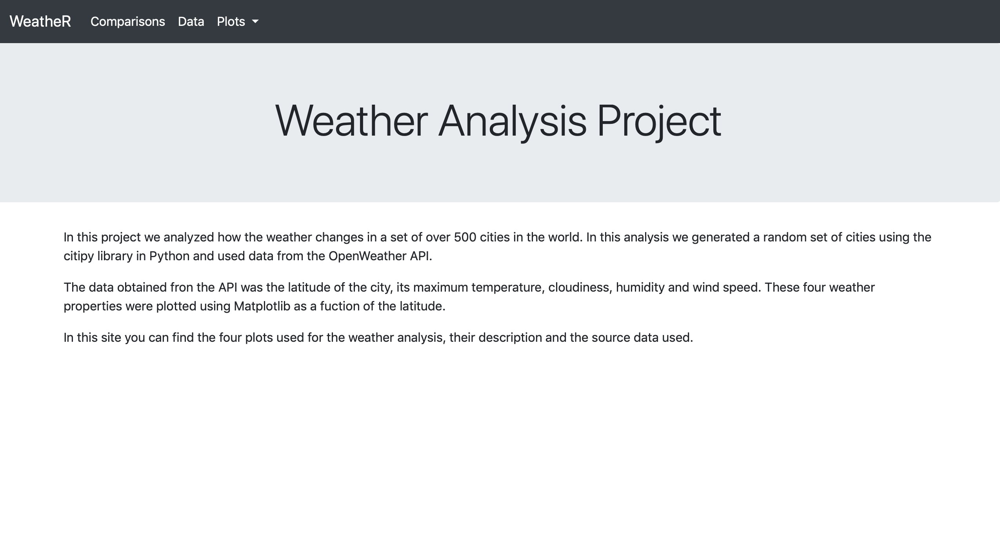
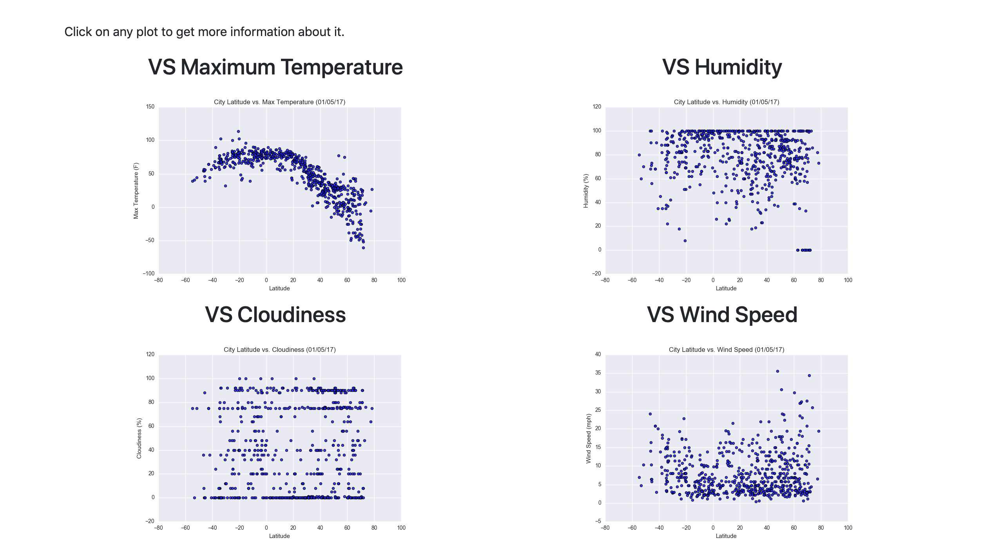
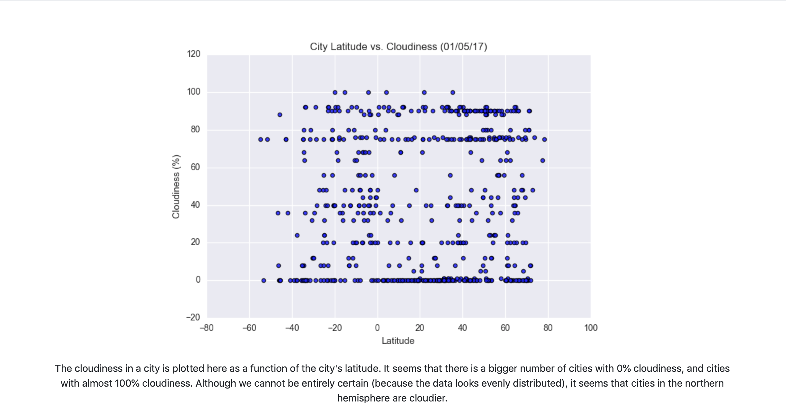

# Web Design Challenge

The site can be seen here: https://jacalderonn.github.io/Web-Design-Challenge/

In this project I analyzed how the weather changes in a set of over 500 cities in the world. In this analysis I generated a random set of cities using the citipy library in Python and used data from the OpenWeather API.

The data obtained fron the API was the latitude and longitude of the city, its maximum temperature, cloudiness, humidity and wind speed. These four weather properties were plotted using Matplotlib as a fuction of the latitude.

## Built With

* HTML
* Bootstrap
* Pandas
* Matplotlib

